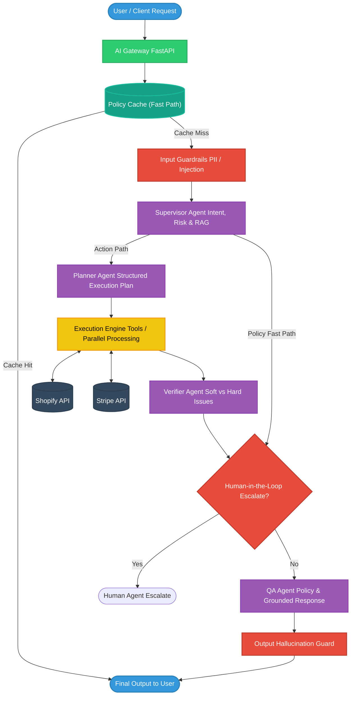

<h1 align="center">D2C Customer AI Support Agent </h1>

<p align="center">
  <em>A production-oriented, multi-agent AI system for D2C and Quick Commerce brands to automate support workflows.</em>
</p>

<p align="center">
  
  
  
  
  
  
  
  
  
</p>

---

## Overview

The **D2C Customer AI Support Agent** is a state-of-the-art, multi-agent customer support system tailored for Direct-to-Consumer (D2C) and Quick Commerce platforms. Built on modern agentic frameworks, it autonomously handles real-world support workflows including returns, refunds, order cancellations, and policy inquiries.

With a strong focus on enterprise requirements, it integrates **planning**, **tool execution**, **policy grounding**, **human-in-the-loop (HITL) escalation**, **robust guardrails**, and **comprehensive observability**.

---

## Key Features

- **Multi-Agent Orchestration**: Powered by [LangGraph](https://python.langchain.com/docs/langgraph), orchestrating intent detection, planning, execution, verification, and QA agents.
- **Semantic Routing & Policy Fast-Path**: Intelligent routing bypasses heavy tool-execution pipelines for generic FAQ/policy inquiries, utilizing RAG prefetching for rapid responses.
- **Structured Planning**: Dynamic dependency resolution and missing-input detection for complex multi-step workflows.
- **Resilient Tool Execution Engine**: Supports retries, timeouts, and parallel execution of external tools (e.g., Shopify, Stripe).
- **Policy-Grounded Responses**: Retrieval-Augmented Generation (RAG) using company documents via Pinecone to ensure accurate answers.
- **Enterprise Guardrails & Security**: Built-in protections against Prompt Injections, out-of-scope queries, and PII leakage. Includes an **Output Hallucination Guard** to prevent fake logistics claims and enforces **verified customer checks** for sensitive, high-value actions.
- **Human-in-the-Loop (HITL)**: Automatic escalations for high-risk, high-value, or unresolved edge cases.
- **Multi-Tenant Configuration**: Easily adapt the agent's tone, approval thresholds, and toolsets per brand.
- **Interactions Intelligence API**: Captures rich, metadata-tagged conversation histories to enable continuous evaluation and analytics.
- **Full Observability & Telemetry**: Deep tracing via LangSmith, structured JSON logging, and Prometheus/Grafana integration.
- **Automated Evaluation**: Golden set regression testing to ensure continuous improvement and zero regressions.

---

## System Architecture

The agent's workflow follows a directed acyclic graph (DAG) structure ensuring step-by-step reasoning, validation, and safe execution.


```mermaid
graph TD
    %% Define Styles
    classDef client fill:#3498db,stroke:#2980b9,stroke-width:2px,color:white;
    classDef gateway fill:#2ecc71,stroke:#27ae60,stroke-width:2px,color:white;
    classDef guardrail fill:#e74c3c,stroke:#c0392b,stroke-width:2px,color:white;
    classDef agent fill:#9b59b6,stroke:#8e44ad,stroke-width:2px,color:white;
    classDef execution fill:#f1c40f,stroke:#f39c12,stroke-width:2px,color:black;
    classDef external fill:#34495e,stroke:#2c3e50,stroke-width:2px,color:white;
    classDef memory fill:#16a085,stroke:#1abc9c,stroke-width:2px,color:white;

    %% Nodes
    User(["User / Client Request"])
    API["AI Gateway FastAPI"]
    PolicyCache[("Policy Cache (Fast Path)")]
    Guard["Input Guardrails PII / Injection"]
    Supervisor["Supervisor Agent Intent, Risk & RAG"]
    Planner["Planner Agent Structured Execution Plan"]
    Engine["Execution Engine Tools / Parallel Processing"]
    Shopify[("Shopify API")]
    Stripe[("Stripe API")]
    Verifier["Verifier Agent Soft vs Hard Issues"]
    HITL{"Human-in-the-Loop Escalate?"}
    QA["QA Agent Policy & Grounded Response"]
    OutputGuard["Output Hallucination Guard"]
    Response(["Final Output to User"])
    HumanAgent(["Human Agent Escalate"])

    %% Edges
    User --> API
    API --> PolicyCache
    PolicyCache -- "Cache Hit" --> Response
    PolicyCache -- "Cache Miss" --> Guard
    Guard --> Supervisor
    
    %% Routing
    Supervisor -- "Action Path" --> Planner
    Supervisor -- "Policy Fast Path" --> HITL
    
    Planner --> Engine
    Engine <--> Shopify
    Engine <--> Stripe
    Engine --> Verifier
    Verifier --> HITL
    
    HITL -- "Yes" --> HumanAgent
    HITL -- "No" --> QA
    
    QA --> OutputGuard
    OutputGuard --> Response

    %% Assign Classes
    class User,Response client;
    class API gateway;
    class PolicyCache memory;
    class Guard,HITL,OutputGuard guardrail;
    class Supervisor,Planner,Verifier,QA agent;
    class Engine execution;
    class Shopify,Stripe external;
```

### Core Components

1. **AI Gateway (`gateway/`)**: A FastAPI-based REST API that handles incoming user requests, policy caching, authentication, verification checks, and final output guardrails.
2. **Orchestration (`orchestration/`)**: The LangGraph DAG definition (`graph.py`). Contains specific node implementations:
   - `supervisor.py`: Detects intent, assesses risk, and fetches context.
   - `routing.py`: Directs traffic between execution action paths and policy fast paths.
   - `planner.py`: Breaks down tasks into a structured JSON plan.
   - `execution.py`: Executes tool calls safely.
   - `verifier.py`: Verifies if the executed tools resolved the user query.
   - `hitl.py`: Manages escalation flows.
3. **Tools (`tools/`)**: Integrations with external SaaS (e.g., Shopify, Stripe) and internal databases.
4. **Agents (`agents/`)**: Specialized sub-agents (e.g., `qa.py` for synthesizing answers).
5. **RAG (`rag/`)**: Document chunking, embedding generation, Pinecone vector store integration, and policy caching.
6. **Security & Guardrails (`security/`)**: Guards against PII leaks, prompt injection, and output hallucinations (e.g., preventing fake logistics tracking IDs).
7. **Interactions Intelligence (`interactions/`)**: Centralized tracking for conversation histories, intents, and metadata to power continuous improvements.

---

## Project Structure

```text
.
├── agents/             # Specialized agent definitions (QA, etc.)
├── attachments/        # User attachment parsing and handling
├── common/             # Shared utilities and helpers
├── config/             # Multi-tenant and system configurations
├── deployments/        # K8s, Docker deployment manifests
├── evaluation/         # Regression tests and LangSmith evaluators
├── frontend/           # Sample UI for interacting with the AI Agent
├── gateway/            # FastAPI entry points and API routers
├── llm/                # LLM client wrappers (Ollama, OpenAI)
├── memory/             # Conversation history and state management
├── observability/      # Logging, Prometheus metrics, OpenTelemetry
├── orchestration/      # LangGraph state machine and execution nodes
├── rag/                # Document retrieval and Pinecone integration
├── security/           # Guardrails (PII, Prompt Injection detection)
├── tests/              # Unit and integration test suites
├── tools/              # External API integrations (Shopify, Stripe)
├── main.py             # Application entry point
├── pyproject.toml      # Dependency management (uv)
└── docker-compose.yml  # Local development stack (Redis, Postgres, Prometheus)
```

---

## Release gate

`python -m evaluation.release_gate` is the P0 check that unauthorized Stripe creates stay at zero.

It runs the policy, platform, workflow, and approval tests, then the ten in-process scenarios in `evaluation/scenarios/p0_platform.yaml`. Those scenarios do not need `/chat`.

Set `EVAL_HTTP=1` to also run the 12 golden chats against `http://127.0.0.1:8000/chat`. That step runs only when `/health` answers. If the API is down, the gate prints `SKIP http goldens` and the in-process scenarios still decide pass or fail.

`EVAL_HTTP_MULTI=1` does the same for multi-turn goldens. `SKIP retrieval` means Pinecone is not configured, and that skip does not fail the gate.

A failed scenario or any unauthorized Stripe create prints `GATE FAIL` and exits 1. The JSON report is written to `evaluation/reports/release_gate_<timestamp>.json`.

`TOOLS_MODE=mock` is the local and container default. Mock boot does not need Shopify, Stripe, or Gmail secrets. `GET /health` returns `status`, `tools_mode`, and `db`, and it does not open a Shopify client. Live mode (`TOOLS_MODE=live`) requires `SHOPIFY_SHOP_DOMAIN`, `SHOPIFY_ACCESS_TOKEN`, and `STRIPE_SECRET_KEY` at the moment a live tool call is constructed.

`SKIP http goldens` means `/health` did not answer, so the 12 `/chat` goldens were not run. `SKIP retrieval` means Pinecone was not required for this gate. Neither skip hides an in-process Stripe failure.

## Frozen retrieval benchmark

`python -m evaluation.rag.run_retrieval` scores the 39 answerable rows in `evaluation/rag/dataset.json` with dense retrieval, `rag/bm25_corpus_zepto.pkl`, reciprocal rank fusion, dedup, and rerank. It exits 1 when the BM25 file is missing, and it does not copy `evaluation/reports/rag_benchmark_latest.json` unless `python -m evaluation.rag.validate` passes.

On a frozen 39-question Zepto policy set, hybrid retrieval (dense + BM25 + RRF + dedup + rerank) reached Recall@5 1.0000 and MRR 0.7936; 0/39 gold clauses missed top 5. That line is the output of validate on `evaluation/reports/rag_benchmark_latest.json`. The August clause-chunk baseline in `evaluation/reports/retrieval_eval_20260811_185842.json` was Recall@5 0.9744 and MRR 0.7842 after rerank, from Recall@5 0.59 and MRR 0.36 before clause-level chunking.

Pull-request CI runs `tests/evaluation/test_rag_metrics.py` only for this benchmark. The nightly job runs `python -m evaluation.rag.run_retrieval`.

## Getting Started

### Prerequisites

- **Python 3.12+**
- **[uv](https://github.com/astral-sh/uv)** (Recommended for fast dependency management)
- **Docker & Docker Compose** (for running Redis, Postgres, Prometheus locally)
- Access to an LLM provider (Ollama running locally or an OpenAI API key)

### Installation

1. **Clone the repository:**
   ```bash
   git clone <your-repo-url>
   cd D2C
   ```

2. **Set up the environment:**
   We recommend using `uv` to sync dependencies:
   ```bash
   uv sync
   # Or create a virtual environment manually:
   # python -m venv .venv
   # source .venv/bin/activate
   # pip install -r requirements.txt
   ```

3. **Configure Environment Variables:**
   Create a `.env` file in the root directory (you can copy `.env.example` if available) and add your keys:
   ```ini
   # LLM Providers
   OPENAI_API_KEY="your-openai-api-key"
   OLLAMA_BASE_URL="http://localhost:11434"

   # Vector Store
   PINECONE_API_KEY="your-pinecone-api-key"

   # External Tools
   SHOPIFY_ACCESS_TOKEN="your-shopify-token"
   STRIPE_API_KEY="your-stripe-key"
   
   # Tracing
   LANGCHAIN_TRACING_V2=true
   LANGCHAIN_API_KEY="your-langsmith-key"
   LANGCHAIN_PROJECT="d2c-support-agent"
   ```

### Running Locally

1. **Start the Infrastructure Dependencies:**
   Launch Redis (for caching/memory), Prometheus, and Grafana via Docker Compose:
   ```bash
   docker-compose up -d
   ```

2. **Start the FastAPI Server:**
   ```bash
   uv run uvicorn main:app --reload --host 0.0.0.0 --port 8000
   ```

3. **Access the API:**
   - Swagger Documentation: [http://localhost:8000/docs](http://localhost:8000/docs)
   - Health Check: [http://localhost:8000/health](http://localhost:8000/health)

---

## Observability

This project strongly emphasizes observability to safely run AI in production.

- **Metrics**: Prometheus exposes metrics at `/metrics` (tracked in `observability/`).
- **Dashboards**: Grafana is configured in `docker-compose.yml` to scrape Prometheus.
- **Tracing**: LangSmith captures all agent reasoning steps, tool payloads, and latency.

---

## Testing & Evaluation

Run the test suite using `pytest`:

```bash
uv run pytest
```

For regression testing against the golden dataset (evaluating the agent's RAG and tool-use performance):

```bash
uv run python -m evaluation.run_evals
```

---

## Contributing

1. Fork the repository
2. Create your feature branch (`git checkout -b feature/amazing-feature`)
3. Commit your changes (`git commit -m 'Add some amazing feature'`)
4. Push to the branch (`git push origin feature/amazing-feature`)
5. Open a Pull Request

---
